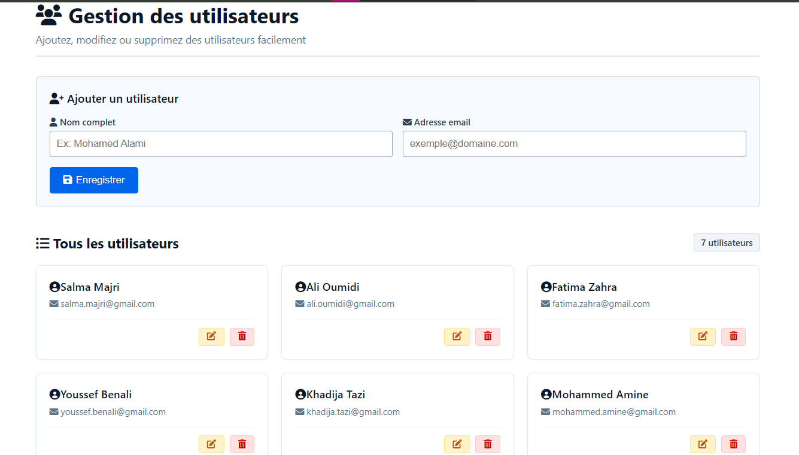
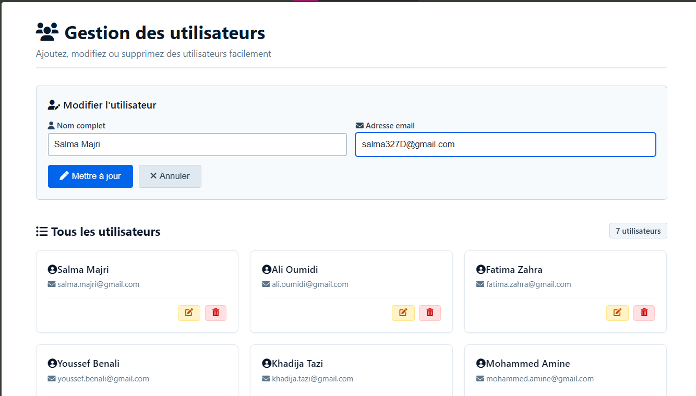
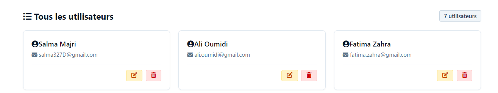

# Projet Fin de Module : Gestion des Utilisateurs (CRUD)

Ce projet est une application web Full-Stack permettant de gérer une liste d'utilisateurs, intégrant les fonctionnalités fondamentales du **CRUD** (Create, Read, Update, Delete) avec une architecture découplée Frontend / Backend.

---

##  Informations Étudiante & Encadrement

| Champ | Détail |
|---|---|
| **Nom & Prénom** | Majri Salma |
| **Filière** |  SDIA-1 |
| **Encadrée par** | Mme. Oumayma Agherai |
| **Établissement** | École Normale Supérieure de l'Enseignement Technique (ENSET) Mohammedia |

---

##  Technologies Utilisées

| Couche | Technologies |
|---|---|
| **Frontend** | React.js (Vite), CSS3 (Layout fluide, Grille de cartes), FontAwesome |
| **Backend** | Node.js, Express, CORS |

---

##  Captures d'écran de l'Application

### 1. Vue d'ensemble — Affichage des utilisateurs sous forme de cartes

L'interface par défaut affiche un formulaire d'ajout et la liste des utilisateurs récupérée dynamiquement depuis le serveur backend.



### 2. Modification d'un utilisateur

Au clic sur l'icône de modification, le formulaire charge les données de l'utilisateur ciblé et passe en mode **"Mettre à jour"**.



### 3. Mise à jour des informations

Les données modifiées sont immédiatement synchronisées avec l'API Express et répercutées visuellement sur les cartes.



---

##  Guide d'Installation et de Lancement

### Prérequis

- [Node.js](https://nodejs.org/) (v18 ou supérieur)
- npm

### 1. Cloner le dépôt

```bash
git clone https://github.com/Salma-Majri/gestion-utilisateurs-crud.git
cd gestion-utilisateurs-crud
```

### 2. Lancer le Backend

```bash
cd backend
npm install
node server.js
```

> Le serveur démarre sur `http://localhost:3000` (ou le port configuré).

### 3. Lancer le Frontend

Ouvrir un **nouveau terminal** :

```bash
cd frontend
npm install
npm run dev
```

> L'application est accessible sur `http://localhost:5173`.

---

##  Structure du Projet

```
gestion-utilisateurs-crud/
├── backend/
│   ├── server.js
│   └── package.json
├── frontend/
│   ├── src/
│   ├── index.html
│   └── package.json
└── screenshots/
    ├── img1.png
    ├── img2.png
    └── img3.png
```

---

##  Fonctionnalités

- **Créer** un utilisateur via le formulaire
- **Afficher** la liste des utilisateurs sous forme de cartes
- **Modifier** les informations d'un utilisateur existant
- **Supprimer** un utilisateur
- Synchronisation en temps réel entre le frontend React et l'API Express